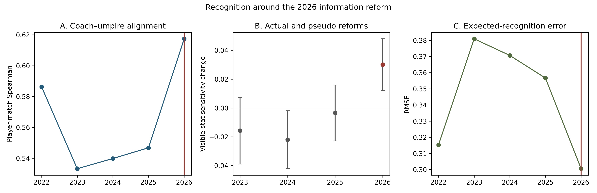
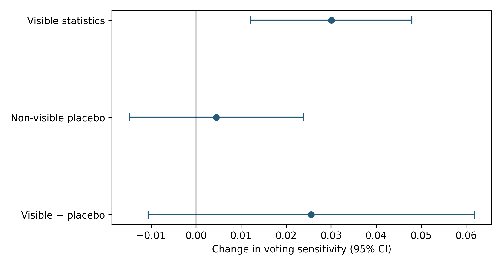

# When Judges Get the Data

## Recognition Around the 2026 Brownlow Medal Information Reform

Reproducibility repository for a prospective SSAC27 Research Paper Competition submission.

In 2026, AFL field umpires were provided approved player-performance statistics for the first time before finalising Brownlow Medal votes. We study whether recognition patterns changed around this information reform using rolling out-of-time expected-recognition models for 2022–2025 and a prospectively frozen 2026 holdout.



## Research question

Did Brownlow voting change unusually in 2026, and was that change concentrated in the statistical information newly supplied to umpires?

## Institutional setting

After every home-and-away match, AFL field umpires allocate exactly six Brownlow Medal votes using a 3–2–1 system. From 2026, umpires could consult 17 approved Champion Data categories after the match. Sixteen map reliably to the research data; kick-ins are unavailable and are not proxied.

## Identification

The primary model compares the change in voting sensitivity to an equal-weight, within-match-ranked index of officially supplied statistics with a prespecified non-visible placebo index. It uses season and position fixed effects, controls for team result, and clusters uncertainty by match. Pseudo reforms apply the identical expanding-window specification to 2023, 2024, and 2025.

This is a structural-change study, not a causal natural experiment: only one post-reform season exists and there is no untreated AFL control group.

## Main results

- Visible-stat sensitivity increased by **0.0301** in 2026 (95% CI **[0.0122, 0.0480]**).
- Identical pseudo-reform estimates were −0.0158 (2023), −0.0221 (2024), and −0.0034 (2025).
- The aggregate non-visible placebo change was 0.0045 [−0.0148, 0.0238].
- The direct visible-minus-placebo contrast was +0.0256 [−0.0107, 0.0618], preventing clean reform-specific attribution.
- Coach–umpire player-match Spearman alignment increased from a 2022–2025 mean of 0.552 to 0.617: Δ=+0.0659 [0.0430, 0.0894].
- All three alternative composites and all 16 leave-one-visible-stat-out specifications preserved a positive 2026 visible-stat change.



## Predictive measurement instrument

The full expected-recognition model achieved 2022–2026 RMSE 0.3465 versus 0.3820 for ridge and 0.3930 for a coach-vote benchmark. The frozen 2026 forecast achieved RMSE 0.3005, 69.6% three-vote winner accuracy, and 75.7% top-three recall. Forecasting validates the measurement instrument; it is not the paper's central contribution.

## Robustness and negative results

The 2026 visible change remains positive under equal-weight z scores, pre-2026 PCA weights, pre-2026 predictive weights, exclusion of 2022, and every leave-one-stat-out model. A development-period recognition-persistence association did not replicate in the frozen 2026 holdout and is retained as a negative result.

## Repository map

- `paper/abstract.md` — submission-length abstract.
- `paper/METHODS_APPENDIX.md` — estimators, uncertainty and transformations.
- `protocol/` — frozen specifications and lock hashes.
- `results/` — aggregate, non-row-level result tables.
- `audit/` — claim, interpretation, provenance and permissions audits.
- `data/` — source documentation only; restricted raw data are not redistributed.
- `src/` — ordered reproduction scripts: expected-recognition panel, information-reform analysis, then final identification.

## Reproducibility and data

The analysis code, frozen protocols, aggregate outputs and provenance hashes are provided. The source player-match dataset, AFLCA vote records and reconstructed AFL Tables labels are currently excluded because redistribution permission has not been established. See [`data/README.md`](data/README.md) and [`audit/DATA_RELEASE_PLAN.md`](audit/DATA_RELEASE_PLAN.md).

After placing authorised inputs under the gitignored `data/private/` directory, run:

```bash
python src/run_expected_recognition_panel.py
python src/run_information_reform.py
python src/run_final_identification.py
```

Row-level intermediates are written to the gitignored `data/derived/` directory. The checked-in `results/` files are the frozen aggregate outputs used by the manuscript.

This repository must not be represented as satisfying SSAC's data-release requirement until written permission or conference guidance resolves that restriction.

## Citation

See [`CITATION.cff`](CITATION.cff).
